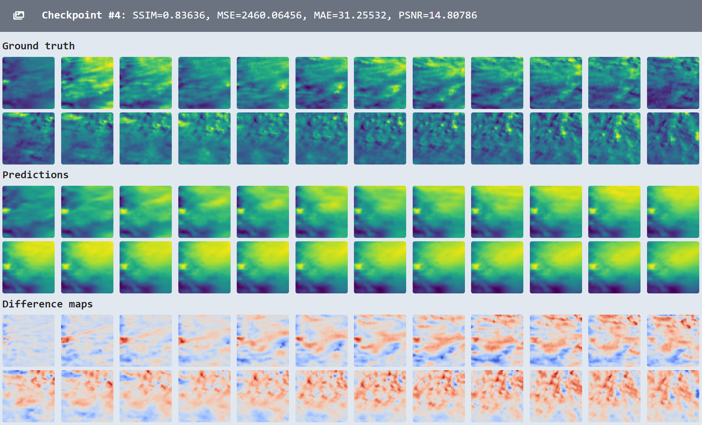
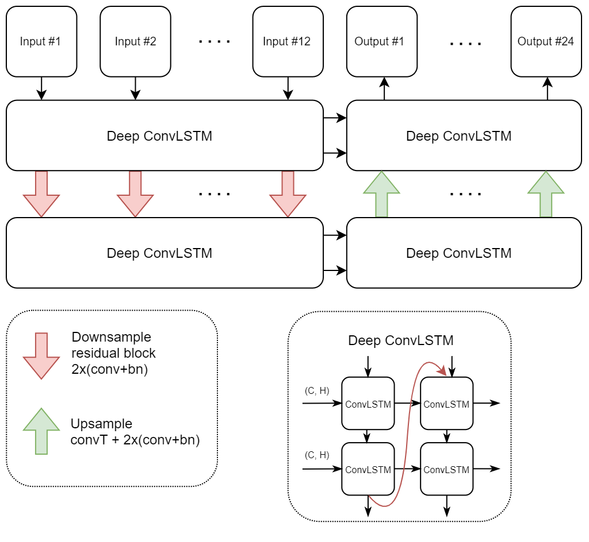

# climatehack

"[Climate Hack.AI](https://climatehack.ai/) is a collaborative initiative between the student communities of 25 universities leading in CS and AI from across the United States, the United Kingdom and Canada to take a lead in the fight against climate change."

## Example output

## ConvLSTM model

